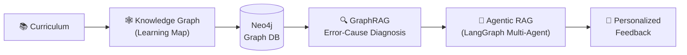
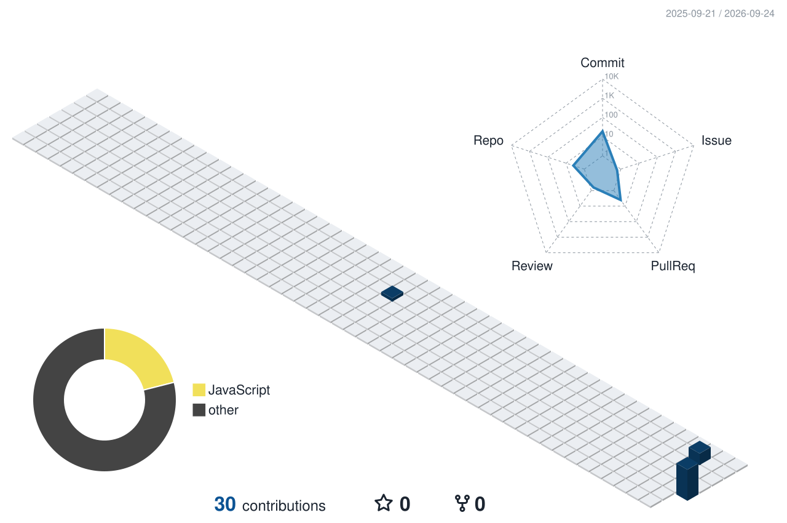

  

  

###  Nice ways to reach me

---

안녕하세요 👋 저는 교육과정을 **지식그래프** 로 구조화하고, 그 위에서 학생의 학습을 진단 및 맞춤 피드백 시스템을 만들고 있습니다.

---

### 🧭 What I'm Working On

- 🕸️ **Knowledge Graph** — 교육과정의 성취기준·지식 요소를 연결한 지식그래프 연구.
- 🔍 **GraphRAG for Error Diagnosis** — GraphRAG를 활용한 학생의 오답 원인 진단 연구.
- 🤖 **Agentic RAG & Multi-Agent** — 에이전틱 RAG를 결합한 멀티에이전트 워크플로우 연구.
- 🧑‍🏫 **AI Agents in Education** — 교육용 AI 에이전트의 활용 연구.

---

  
<b>Proficiencies</b>

   

  - 📚 **Languages:** Python, Cypher
  - 🧠 **LLM & RAG:** LangChain, LangGraph, GraphRAG, Agentic RAG, Prompt Engineering, OpenAI GPT-4o
  - 🕸️ **Graph & Knowledge:** Neo4j, Knowledge Graph, Ontology (RDF / OWL)
  - 🔥 **Deep Learning:** PyTorch, Hugging Face, Local LLM, Synthetic Data Augmentation
  - 🔧 **Tools:** Git, GitHub, VS Code, Jupyter

### 💪 Skills

---

  <i>Building indispensable solutions through data, graphs, and AI.</i>
   
  

